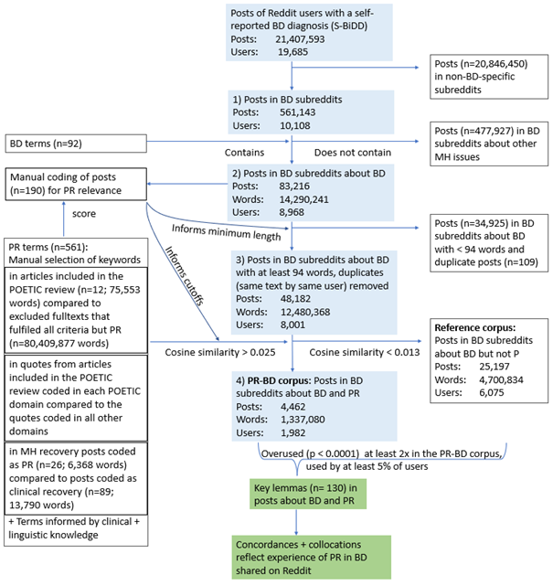

[comment]: https://www.markdownguide.org/basic-syntax/
# Code accompanying the paper "How do people with a bipolar disorder diagnosis talk about personal reovery in peer online support forums? Introducing corpus framework analysis" 

This repository contains the code to reproduce all results from the paper Jagfeld, G., Humphreys, C., Lobban, F., Rayson, P. E., & Jones, S. H. (submitted for publication) How do people with a bipolar disorder diagnosis talk about personal reovery in peer online support forums? Introducing corpus framework analysis" 
.

The data provided in the data/ directory is only made-up example data to show the structure of the data and test the code release.
To obtain the actual data, please contact Glorianna Jagfeld <g.jagfeld@lancaster.ac.uk> or Professor Steven Jones <s.jones7@lancaster.ac.uk>.
You will be provided with a Data Usage Agreement outlining ethical terms of use for the data that you need to sign before getting access to the data.
Access to the data will only be granted for non-commercial research purposes.

By default, the repository expects that the actual data is stored in the data/ subdirectory in the files posts_meta.csv and posts_text.csv.
To run the code on the provided example data, use the optional demo flag for each of the scripts.

ToDo: check if want to remove demo option?

```{verbatim}
## Requirements
python 3.9.5, pandas 1.3.0, numpy 1.20.3
R 4.1.0 ToDo
```

## Constructing the PR-BD Corpus and Reference Corpus
The construction of the corpora follows the four steps outlined in this flowchart:



### Steps 1-3: Select BD posts
```bash
python select_bd_posts.py
```
#### Input
posts_meta.csv and posts_texts.csv

#### Output
posts_bd.csv

#### Expected output
```{verbatim}
ToDo
```

### Step 4: Select PR-relevant posts and not PR relevant posts
```bash
python PR_scoring.py
```
#### Input 
PR_terms.csv

#### Output
posts_bd_spacy_phrases.csv and posts_bd_PR_scored.csv

PR_terms.csv contains the list of 561 PR terms used to score the posts. The column replacement contains the PR terms joined by underscore for PR terms consisting of more than one word

PR_terms_unique_corrected.csv contains the 415 unique PR terms with spelling and phraseological variants for each PR term listed in the column "variants". Five spelling mistakes in the original PR_terms.csv file were corrected: progess was removed because progress was already in the list, pyhsical activity -> physical activity, ( hypo)-manic -> (hypo-)manic, ( hypo-)mania -> (hypo-)mania


#### Expected output
```{verbatim} ToDo update
Concatenated lemmas and identified PR term phrases in 49016 posts
Now writing to C:/Users/glori/Documents/Persönliches/#PhD_local/code/reddit_bd_recovery/data/posts_bd_spacy_phrases.csv
Number of posts x vocabulary size (49016, 56344)
Vectorised posts to shape (49016, 56344)
Created term vector with shape (1, 56344)
Calculated cosine similarity between posts and term vector
                 PR
count  49016.000000
mean       0.013310
std        0.007902
min        0.000000
25%        0.007497
50%        0.012101
75%        0.017832
max        0.071883
48644 posts have non-zero PR score
Finished scoring, writing to C:/Users/glori/Documents/Persönliches/#PhD_local/code/reddit_bd_recovery/data/posts_bd_PR_scored.csv
```

```bash
python create_corpora.py
```
#### Input  
posts_bd_PR_scored.csv

#### Output
PR-BD_Corpus.csv PR-BD_Corpus.txt, Reference_Corpus.csv, Reference_Corpus.txt and one .txt file for each of the ToDo users in the PR-BD
Corpus in the directory PR-BD_Corpus

#### Expected output
```{verbatim}
ToDo
```

ToDo: is the point to share the post ids in the PR-BD Corpus and Reference Corpus

## Generate key lemmas 

### Calculate keyness via LancsBox (LL, LR, dispersion)

Install #LancsBox, available from http://corpora.lancs.ac.uk/lancsbox.
The following instructions pertain to version 6.0.

	1. Import PR-BD Reddit corpus in one-file-per-user-format (PR-BD_Corpus directory) into LancsBox
	2. Import reference corpus (Reference_Corpus.txt) as single file into LancsBox
	3. Calculate log likelihood and dispersion:
        1. Words tool -> load PR-BD Corpus + Reference Corpus
        2. Set Type to Lemma for both corpora
        3. Set Dispersion to "range_percent" for both corpora
        4. Drag and drop PR-BD Corpus into Reference Corpus bubble
        5. Change Statistic to LogLik
        6. Save and rename .txt file in the output folder to PR-BD_terms_LL.txt
    4. Calculate log ratio:
        1. Change Statistic to LogRatio
        2. Save and rename .txt file in the output folder to PR-BD_terms_LR.txt

### Select key lemmas
```bash
python select_key_lemmas.py
```
#### Input
PR-BD_terms_LL.txt, PR-BD_terms_LR.txt

#### Output
PR-BD_terms.csv, PR-BD_key_lemmas.csv

#### Expected output
```{verbatim}
ToDo
```