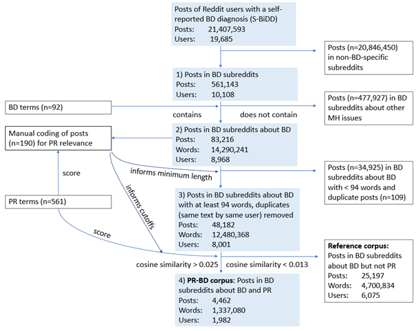

[comment]: https://www.markdownguide.org/basic-syntax/
# Code accompanying the paper "How People With a Bipolar Disorder Diagnosis Talk About Personal Recovery in Peer Online Support Forums: Corpus Framework Analysis Using the POETIC Framework"

This repository contains the code to reproduce all results from the paper [Jagfeld, G., Lobban, F., Humphreys, C., Rayson, P. and Jones, S.H. (2023) ‘How People With a Bipolar Disorder Diagnosis Talk About Personal Recovery in Peer Online Support Forums: Corpus Framework Analysis Using the POETIC Framework’, JMIR Med Inform, 11](https://doi.org/10.2196/46544).

The data ([S-BiDD dataset](https://doi.org/10.17635/lancaster/researchdata/589)) is available for non-commercial reserach purposes upon filling in the [data usage agreement](https://github.com/glorisonne/reddit_bd_mood_posting_mh/blob/main/data/DataUsageAgreement_SBiDDDataset.docx).
To reproduce the results of the main study and exploratory study 2, you require posts_meta.csv and posts_text.csv.
To reproduce exploratory study 1, you additionally require BD_Subreddit_Corpus.txt.

Place the data files in the data/ subdirectory in the repository.

If you just want to replicate generating the key lemmas or would like to check if you successfully reproduced
Constructing the PR-BD Corpus and Reference Corpus, you can create the PR-BD and Reference Corpus directly
from posts_meta.csv and posts_text.csv via the post ids provided in the post_id/ directory.
See step "Creating the PR-BD Corpus and Reference Corpus from post ids".

```{verbatim}
## Requirements
python 3.8.5
pandas 1.2.4
numpy 1.18.5
spacy 3.0.6 with pretrained pipeline en_core_web_sm (3.0.0)
re 2.2.1
plotly 5.13.0
R 4.1.0
```

## Creating the PR-BD Corpus and Reference Corpus from post ids
You can directly generate the PR-BD and Reference Corpus from the post ids to sidestep
all steps of "Constructing the PR-BD Corpus and Reference Corpus".

```bash
python create_corpora.py ids
```

#### Input
PR-BD_Corpus_post_ids.csv, Reference_Corpus_post_ids.csv (placed in post_ids/ folder)

#### Output
PR-BD_Corpus.csv, PR-BD_Corpus.txt, Reference_Corpus.csv, Reference_Corpus.txt and one .txt file for each of the 1982 users in the PR-BD Corpus in the
directory PR-BD_Corpus

#### Expected output
```{verbatim}
Read in ids of 4462 posts
Selected 4462 posts from 4462 ids
Read in ids of 25191 posts
Selected 25191 posts from 25191 ids
```

## Constructing the PR-BD Corpus and Reference Corpus
The construction of the corpora follows the four steps outlined in this flowchart:



### Steps 1-2: Select BD posts
```bash
python select_bd_posts.py
```
#### Input
posts_meta.csv, bipolar-subreddits.txt, posts_texts.csv

#### Output
posts_bd.csv

#### Expected output
```{verbatim}
Posts in BD subreddits:
Posts: 561143
Words: 45380847
Users: 10108
Posts that mention BD:
Posts: 83216
Words: 14290241
Users: 8968
```

### Step 3-4: Remove short posts + duplicates, select PR-relevant posts and not PR relevant posts

#### 3.1 Tokenise + lemmatise posts via spacy
```bash
python process_posts_with_spacy.py data/posts_bd.csv
```
Running this command on a standard personal laptop may take up to five hours.
Please note that in order to reproduce our results, you need to use the exact spacy version (3.0.6) and language
model (en_core_web_sm (3.0.0)) mentioned in the requirements.

#### Input 
posts_bd.csv

#### Output
posts_bd_spacy.csv

#### Expected output
```{verbatim}
0 posts do not have a text
```

#### 3.2 Score PR-relevance of posts
```bash
python PR_scoring.py
```
#### Input 
posts_bd_spacy.csv, PR_terms.csv, posts_bd.csv

PR_terms.csv contains the list of 561 PR terms used to score the posts.
The column replacement contains the PR terms joined by underscore for PR terms consisting
of more than one word.

PR_terms_unique_corrected.csv contains the 415 unique PR terms with spelling and
phraseological variants for each PR term listed in the column "variants".
Four spelling mistakes in the original PR_terms.csv file were corrected:

- progess was removed (progress was already in the list) - hence the paper reports 416 unique PR terms
- pyhsical activity -> physical activity
- ( hypo)-manic -> (hypo-)manic
- ( hypo-)mania -> (hypo-)mania

#### Output
posts_bd_spacy_phrases.csv and posts_bd_PR_scored.csv

#### Expected output
```{verbatim}
Concatenated lemmas from data/posts_bd_spacy.csv
Identified PR term phrases in 83216 posts
Now writing to data/posts_bd_spacy_phrases.csv
Number of posts x vocabulary size (83216, 60242)
Vectorised posts to shape (83216, 60242)
Created term vector with shape (1, 60242)
Calculated cosine similarity between posts and term vector
                 PR
count  83216.000000
mean       0.010991
std        0.008350
min        0.000000
25%        0.004589
50%        0.009707
75%        0.015842
max        0.070993
74795 posts have non-zero PR score
Finished scoring, writing to data/posts_bd_PR_scored.csv
```
#### 3.3 + 4 Remove short posts + duplicates, select posts in PR-BD Corpus and Reference Corpus based on PR score cutoffs
```bash
python create_corpora.py select
```
#### Input  
posts_bd_PR_scored.csv

#### Output
PR-BD_Corpus.csv, PR-BD_Corpus.txt, Reference_Corpus.csv, Reference_Corpus.txt and one .txt file for each of the
1982 users in the PR-BD Corpus in the directory PR-BD_Corpus

#### Expected output
```{verbatim}
Posts with at least 94 words, duplicates removed:
Posts: 48174
Words: 12478592
Users: 8001
PR-BD Corpus:
Posts: 4462
Words: 1505419
Users: 1982
Reference Corpus:
Posts: 25191
Words: 5337456
Users: 6075
```

## Generate key lemmas 

### Calculate keyness via LancsBox (LL, LR, dispersion)

Install [#LancsBox](http://corpora.lancs.ac.uk/lancsbox).
The following instructions pertain to version 6.0.

	1. Import PR-BD Reddit corpus in one-file-per-user-format (PR-BD_Corpus directory) into LancsBox
	2. Import reference corpus (Reference_Corpus.txt) as single file into LancsBox
	3. Calculate log likelihood and dispersion:
        1. Words tool -> load PR-BD Corpus + Reference Corpus
        2. Set Type to Lemma for both corpora
        3. Set Dispersion to "range_percent" for both corpora
        4. Drag and drop PR-BD Corpus into Reference Corpus bubble
        5. Change Statistic to LogLik
        6. Save and rename .txt file in the output folder to PR-BD_terms_LL.txt
    4. Calculate log ratio:
        1. Change Statistic to LogRatio
        2. Save and rename .txt file in the output folder to PR-BD_terms_LR.txt

### Select key lemmas
This step produces the outputs that are also provided in the results folder:
'PR-BD_and_Reference Corpus_terms.csv' and 'PR-BD Corpus_key lemmas.csv'.

```bash
python select_key_lemmas.py
```
#### Input
PR-BD_terms_LL.txt, PR-BD_terms_LR.txt

#### Output
PR-BD_and_Reference Corpus_terms.csv: list of all terms in the PR-BD and Reference corpus and their log likelihood and log ratio score

PR-BD Corpus_key_lemmas.csv: terms from PR-BD_terms.csv that satisfy log likelihood > 15.13 and log ratio >= 1.0 and
dispersion >= 5.0 (key lemmas)

#### Expected output
```{verbatim}
Selected 130 key lemmas with LL > 15.13 & LR >= 1.0 & dispersion >= 5.0
```

## Select posts via post ids
To create any subset of posts from the S-BiDD dataset via provided post ids, do the following:

```bash
python select_posts_via_ids.py post_id_file
```
#### Input
posts_meta.csv, posts_texts.csv, name of a post id file in the post_id/ directory
(e.g. PR-BD_Corpus_post_ids.csv); the filename must be in the format name_post_ids.csv

#### Output
data/name.csv that contains the posts for which the id was provided (meta-data + texts)

#### Expected output
```{verbatim}
for the command 'python select_posts_via_ids.py PR-BD_Corpus_post_ids.csv' the expected output would be:
Read in ids of 4462 posts
Selected 4462 posts from 4462 ids
```

## Exploratory study 1: Key topics in BD subreddits
This study analysed key topics in BD subreddits by calculating the key semantic domains in the BD Subreddit Corpus 
in comparison it to the SMHD Reference Corpus.

### BD Subreddit Corpus
You can request the BD Subreddit corpus [here](https://doi.org/10.17635/lancaster/researchdata/589),
upon providing the filled in [data usage agreement](https://github.com/glorisonne/reddit_bd_mood_posting_mh/blob/02a72b2ae1810503de145f5e77bdff76bb8ab13e/data/DataUsageAgreement_SBiDDDataset.docx).

### SMHD Reference Corpus
The SMHD Reference Corpus consists of randomly sampled posts of randomly selected control users for users with a BD diagnosis
in the SMHD dataset. Access to the dataset can be requested [here](https://ir.cs.georgetown.edu/resources/smhd.html).

post_ids/SMHD_Reference_Corpus_post_ids.csv provides user_id;post_id pairs.
The user ids correspond to the field "id" in SMHD_train.jl.gz in the SMHDv1.1 release.
The post ids correspond to the posts provided in this file in the record with this user id,
indexed starting with 0.

### Corpora processing
Both corpora were tokenised and POS tagged with [CLAWS](https://ucrel.lancs.ac.uk/claws/).
Subsequently, semantic domains were tagged via [USAS](https://github.com/UCREL/pymusas).
Finally, term and semantic domain frequency lists were extracted from both tagged corpora to serve as input for
the calculation of key items.

### Keyness calculation
```bash
python keyness.py -f exploratory_study_1/BD_Subreddit_SMHD_Reference_Corpus[terms/domains]_frequency.csv -n 490364
```
#### Input
exploratory_study_1/BD_Subreddit_SMHD_Reference_Corpus_terms_frequency.csv,
exploratory_study_1/BD_Subreddit_SMHD_Reference_Corpus_domains_frequency.csv

#### Output
exploratory_study_1/BD_Subreddit_SMHD_Reference_Corpus_terms_frequency_keyness.csv,
exploratory_study_1/BD_Subreddit_SMHD_Reference_Corpus_domains_frequency_keyness.csv

The files exploratory_study_1/BD Subreddit Corpus_key terms.csv and exploratory_study_1/BD Subreddit Corpus_key domains.csv provide the 
key terms and semantic domains that were significantly overused in the BD Subreddit corpus compared to the SMHD 
Reference Corpus according to the log likelihood statistic with p < 0.0001
(after Bonferroni correction for n=490,364 comparisons (number of combined unique terms, POS tags, and USAS
domains in the BD Subreddit and SMHD Reference Corpus)).

## Exploratory study 2: Analysis of *recover* term instances

### \*recover\* corpus construction

```bash
python build_recover_corpus.py
```
#### Input
posts_meta.csv, posts_texts.csv
post_ids/posts_contain_recover_post_ids.csv,
exploratory_study_2/recover_content_terms.csv
post_ids/posts_recover_corpus_post_ids.csv,
post_ids/posts_recover_corpus_to_code_post_ids.csv

#### Output
posts_contain_recover.csv, posts_contain_recover_spacy.csv, posts_contain_recover_tokenised.csv,
posts_contain_recover_content_term.csv, output/posts_per_user_top30_contains_recover_content_term.png
posts_recover_corpus_own_sampling.csv, posts_recover_corpus.csv, output/posts_per_user_top30_recover_corpus.png,
posts_recover_corpus_to_code.csv

#### Expected output
See output/build_recover_corpus.log

### Coding results
See exploratory_study_2/recover_coding_results.csv

### Agreement calculation
See agreement.R

## References
1. Jagfeld G, Lobban F, Rayson P, Jones SH. Understanding who uses Reddit: Profiling individuals with a self-reported bipolar disorder diagnosis. In: Proceedings of the Seventh Workshop on Computational Linguistics and Clinical Psychology: Improving Access at NAACL 2021.
2. Jagfeld G, Lobban F, Davies R, Boyd RL, Rayson P, Jones SH. Posting patterns in peer online support forums and their associations with emotions and mood in bipolar disorder: exploratory analysis. (submitted for publication)
